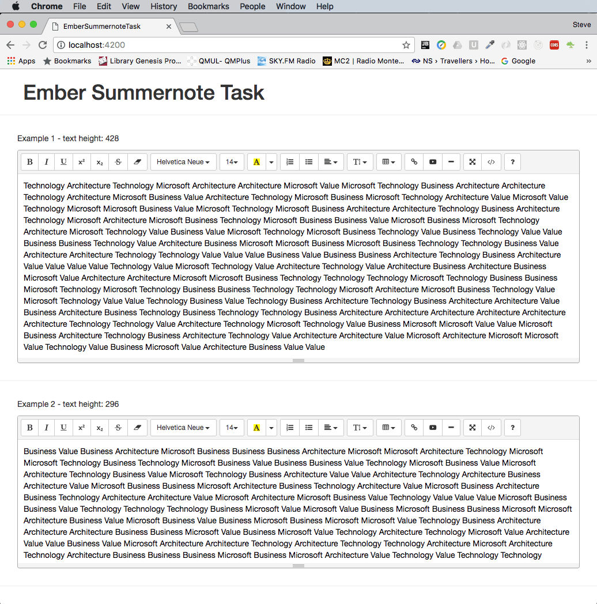

#### Task description
1.	Create a new ember project
2.	Download and install a wysiwyg editor
  -	You can use the ember plugin summernote
  -	https://www.npmjs.com/package/ember-cli-summernote
  - https://github.com/summernote/summernote
  - http://summernote.org/
3.	Show the wysiwyg editor and make sure that - each time the page reloads - it displays a random text of 
at least 50 words and maximum 300 words.
4.	Measure each time the page is loaded the size of the text in the text area and adjust the size of the wysiwyg editor.
5.	Duplicate the editor 5 times and make sure that each editor has its own random text / size, etc.

#### Implementation notes
Probably due to outdated dependencies in the plugins, I had to manually add the _font_ folder 
in `.bower-components/summernote/dist`

----

This README outlines the details of collaborating on this Ember application.
A short introduction of this app could easily go here.

## Prerequisites

You will need the following things properly installed on your computer.

* [Git](https://git-scm.com/)
* [Node.js](https://nodejs.org/) (with NPM)
* [Ember CLI](https://ember-cli.com/)
* [PhantomJS](http://phantomjs.org/)

## Installation

* `git clone <repository-url>` this repository
* `cd ember-summernote-task`
* `npm install`

## Running / Development

* `ember serve`
* Visit your app at [http://localhost:4200](http://localhost:4200).

### Code Generators

Make use of the many generators for code, try `ember help generate` for more details

### Running Tests

* `ember test`
* `ember test --server`

### Building

* `ember build` (development)
* `ember build --environment production` (production)

### Deploying

Specify what it takes to deploy your app.

## Further Reading / Useful Links

* [ember.js](http://emberjs.com/)
* [ember-cli](https://ember-cli.com/)
* Development Browser Extensions
  * [ember inspector for chrome](https://chrome.google.com/webstore/detail/ember-inspector/bmdblncegkenkacieihfhpjfppoconhi)
  * [ember inspector for firefox](https://addons.mozilla.org/en-US/firefox/addon/ember-inspector/)
